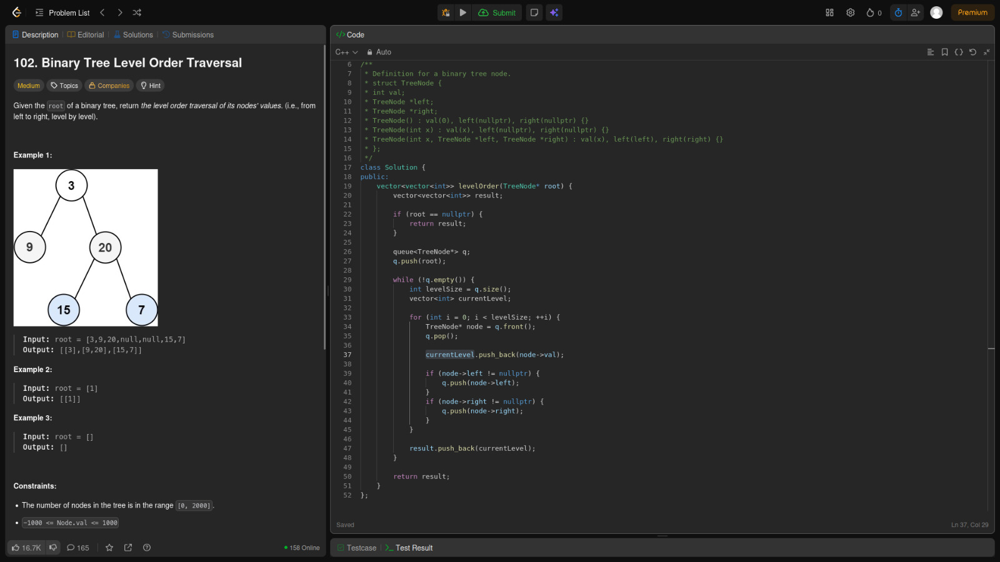
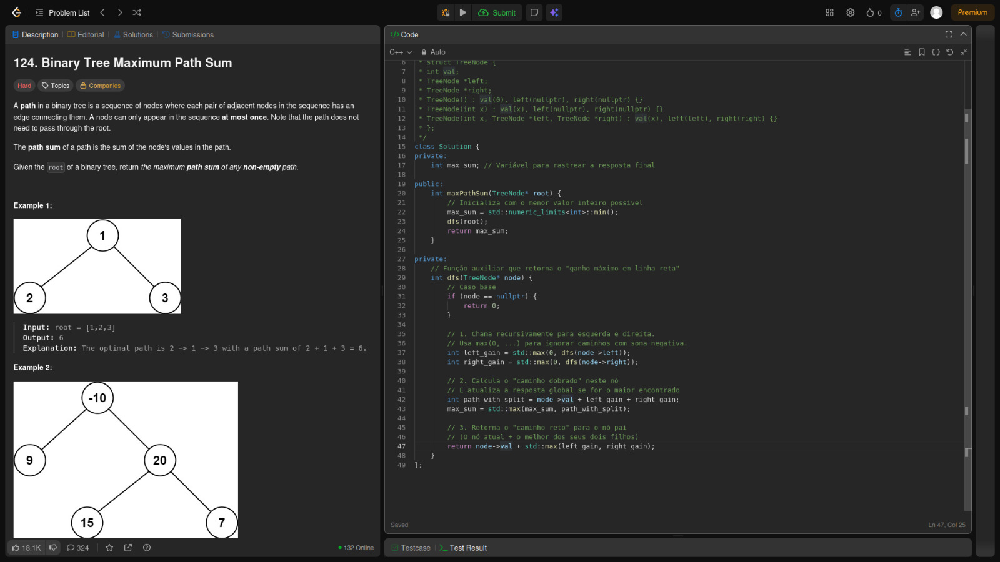
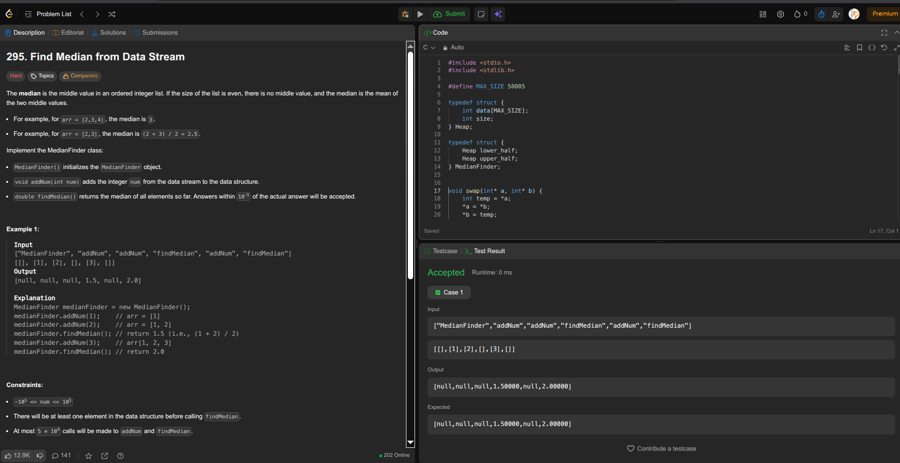
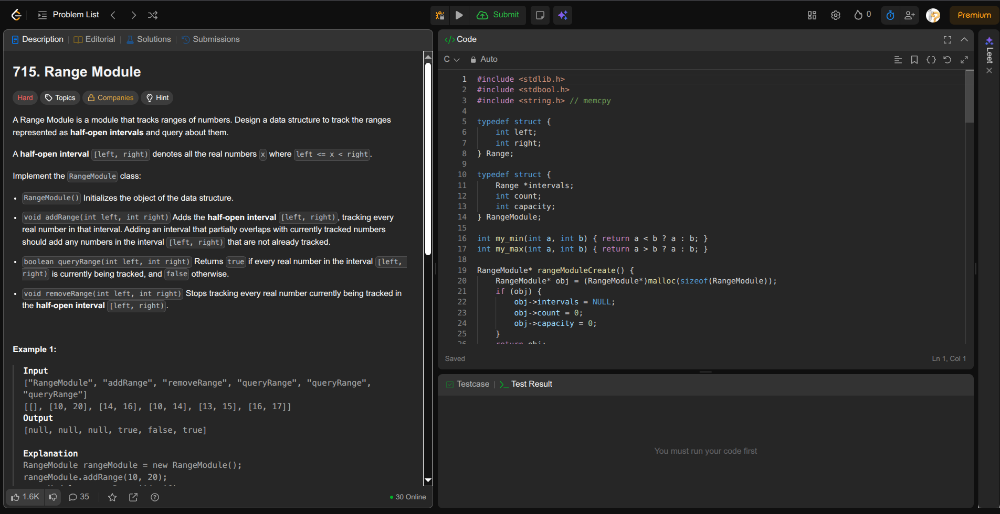

#  Projeto: Estruturas de Dados — Árvores (Trees)

## Alunos

| Matrícula | Nome |
|-----------|------|
| 21/1062240 | Mateus Bastos dos Santos |
| 21/1062320 | Miguel Arthur Oliveira de Lima |

---

## Descrição do Projeto

Este projeto foi desenvolvido como parte do segundo trabalho da disciplina de **Estruturas de Dados e Algoritmos II (EDA2)**, com foco em **árvores binárias e estruturas derivadas**.  

O objetivo é compreender o funcionamento, a implementação e a aplicação prática de **algoritmos envolvendo árvores**, utilizando a plataforma **LeetCode** para a execução e validação das soluções.

---

## Exercícios Selecionados

> Foram selecionados **2 exercícios de nível Médio** e **2 exercícios de nível Difícil**, todos relacionados ao tema de Árvores (Trees) e suas aplicações.

| Exercício | Dificuldade | Estrutura Principal |
|-----------|-------------|---------------------|
| [01. Binary Tree Level Order Traversal](https://leetcode.com/problems/binary-tree-level-order-traversal/) | Médio | Árvore Binária / BFS |
| [02. Binary Tree Maximum Path Sum](https://leetcode.com/problems/binary-tree-maximum-path-sum/) | Difícil | Árvore Binária / DFS / Programação Dinâmica |
| [03. Find Median from Data Stream](https://leetcode.com/problems/find-median-from-data-stream/) | Difícil | Heaps / Árvores de Busca Balanceadas |
| [04. Range Module](https://leetcode.com/problems/range-module/) | Difícil | Interval Tree / Segment Tree / Mapas Ordenados |

---

# Exercícios Desenvolvidos

---

## 102. Binary Tree Level Order Traversal (Médio)

**Autor:** Miguel Arthur   

**Conceito:**  
O objetivo é percorrer uma árvore binária **nível por nível (level order traversal)** — ou seja, visitar todos os nós de um nível antes de avançar para o próximo.  
A abordagem clássica utiliza uma **fila (queue)** e a técnica de **busca em largura (BFS)** para organizar o percurso.

 **Técnicas Utilizadas:**  
- Estrutura de dados: Fila  
- Algoritmo: BFS (Breadth-First Search)  

[ Link do Exercício no LeetCode](https://leetcode.com/problems/binary-tree-level-order-traversal/)

---

## 124. Binary Tree Maximum Path Sum (Difícil)

**Autor:** Miguel Arthur 

**Conceito:**  
Neste problema, busca-se o **caminho com a soma máxima** dentro de uma árvore binária.  
O caminho pode começar e terminar em qualquer nó.  
A solução utiliza **busca em profundidade (DFS)** e **programação dinâmica**, atualizando recursivamente a soma máxima global.

 **Técnicas Utilizadas:**  
- Recursão com DFS  
- Cálculo de caminhos parciais  
- Atualização global da soma máxima  

[ Link do Exercício no LeetCode](https://leetcode.com/problems/binary-tree-maximum-path-sum/)

---

## 295. Find Median from Data Stream (Médio)

**Autor:** Mateus Bastos 

**Conceito:**  
O desafio é projetar uma estrutura de dados que permita **inserir números continuamente** e **encontrar a mediana em tempo eficiente**.  
A estratégia ideal utiliza **duas heaps** (máx-heap e min-heap) para manter as duas metades dos elementos equilibradas.

 **Técnicas Utilizadas:**  
- Estrutura: Heap Dupla (Max-Heap + Min-Heap)  
- Balanceamento dinâmico após inserções  
- Cálculo eficiente da mediana  

[ Link do Exercício no LeetCode](https://leetcode.com/problems/find-median-from-data-stream/)

---

## 715. Range Module (Difícil)

**Autor:** Mateus Bastos 

**Conceito:**  
O problema consiste em implementar um **módulo de intervalos (Range Module)** que permita **adicionar**, **remover** e **consultar** faixas numéricas.  
A solução eficiente faz uso de **árvores de segmentos (Segment Trees)** ou **mapas ordenados (TreeMap)** para gerenciar os intervalos e evitar sobreposições.

 **Técnicas Utilizadas:**  
- Estrutura: Interval Tree / Segment Tree  
- Operações de união e remoção de intervalos  
- Busca binária para localizar faixas  

[ Link do Exercício no LeetCode](https://leetcode.com/problems/range-module/)

---

##  Como Validar os Exercícios

### Passo 1: Acessar o LeetCode
1. Vá para [https://leetcode.com/](https://leetcode.com/)
2. Crie uma conta gratuita ou faça login.

### Passo 2: Navegar até o Exercício
1. Pesquise pelo número do exercício (ex: “102” ou “715”)
2. Ou clique diretamente nos links fornecidos acima.

### Passo 3: Submeter o Código
> 1. Selecione **C++** como linguagem para os exercícios 01 e 02, e **C** para os exercícios 03 e 04.  
> 2. Copie o código do repositório local.  
> 3. Cole no editor do LeetCode.  
> 4. Clique em **Run** e depois em **Submit** para validar sua solução.

---

## Imagens do Projeto

### Exercício 102. Binary Tree Level Order Traversal

  

---

### Exercício 124. Binary Tree Maximum Path Sum

  

---

### Exercício 295. Find Median from Data Stream

  

---

### Exercício 715. Range Module

  

---

## 🎥 Vídeo

<h2 align="center"> Apresentação – Árvores e Estruturas Avançadas</h2>

Explicamos todos os códigos implementados na plataforma LeetCode, detalhando a lógica de cada exercício e sua relação com as estruturas de dados estudadas em EDA II.

  <table>
    <tr>
      <td align="center"><b>Vídeo 01</b></td>
    </tr>
    <tr>
      <td align="center">
        <a href="https://www.youtube.com/embed/W_YO7TrVseg" target="_blank" target="_blank">
          Apresentação — Árvores - Estruturas de Dados — EDA II — UnB FCTE
        </a>
      </td>
    </tr>
  </table>

---

 **Disciplina:** Estruturas de Dados e Algoritmos II — Universidade de Brasília  
 **Período:** 2025.2  

---
